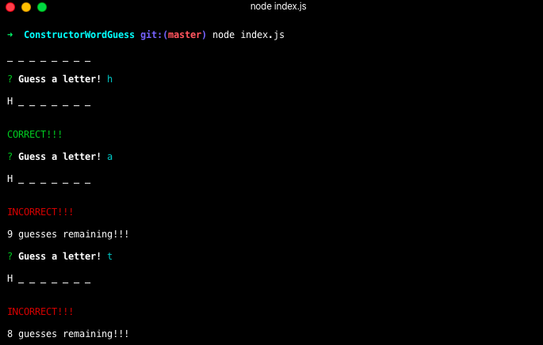
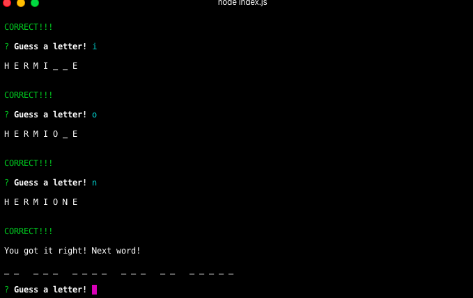
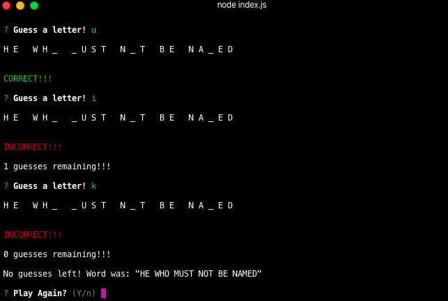

# ***ConstructorWordGuess***

## ***About the Game***

This is a command line/ terminal word guessing game. I love Harry Potter so it is a variety of thier characters.

### ***How to Use:***

Clone to your local drive and use the prompt node index.js to begin the game

#### ***Step by Step Instructions:***
    1. Run node index.js in terminal after cloning to drive
    2. Start guessing letters and see how good you are!

##### ***Summary***

This images shows what to expect at the start of the game a well as a couple correct and incorrect letter choices. 

This is what happens when you guess a word correctly.

Finally, this is what happens when you run out of guesses.

### ***Deployed Version Link***

https://chelsea4crooke.github.io/ConstructorWordGuess/

#### ***Technologies Used:***
    1. Github
    2. Git
    3. Node Modules
    4. Inquirer
    5. Javascript
    6. Ojbects
    7. .this
    8. Callbacks
    9. Constructors
    10. Prototypes